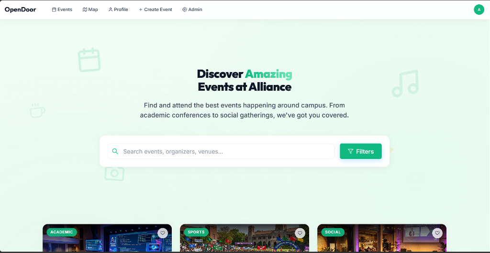
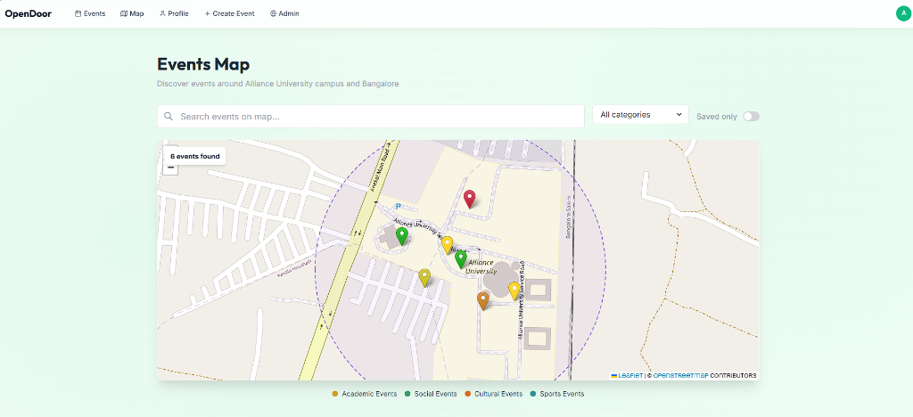
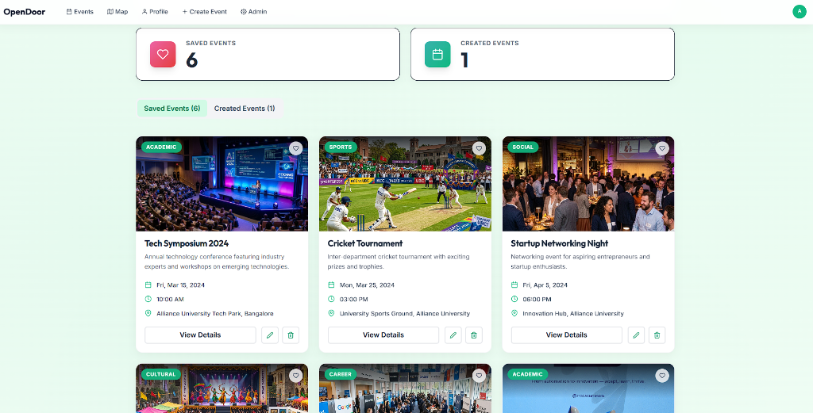
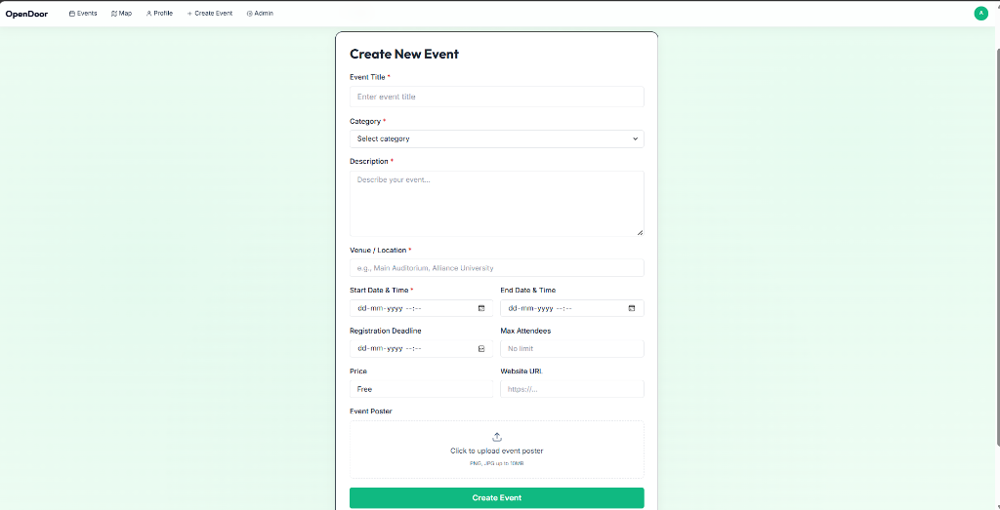
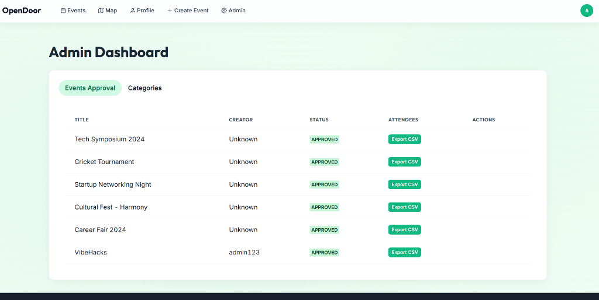

# 🎓 OpenDoor — Premium University Event Discovery & Management Platform

<div align="center">

**A comprehensive event ecosystem built for the Alliance University community**

[](https://nodejs.org/)
[](https://reactjs.org/)
[](https://www.mongodb.com/)
[](https://chakra-ui.com/)
[](LICENSE)

</div>

---

## 📖 Table of Contents

- [Overview](#-overview)
- [Screenshots](#️-screenshots)
- [Real-Life Use Cases](#-real-life-use-cases)
- [High-Level Design](#-high-level-design)
- [Folder Structure](#-folder-structure)
- [Technical Architecture](#-technical-architecture)
- [Database Design](#-database-design)
- [API Documentation](#-api-documentation)
- [Features](#-features)
- [Setup & Installation](#-setup--installation)
- [Workflows](#-workflows)
- [Security](#-security)
- [Future Roadmap](#-future-roadmap)
- [Contributing](#-contributing)
- [License](#-license)

---

## 🌟 Overview

**OpenDoor** is a next-generation event discovery and management platform that transforms campus activities into a seamless, engaging experience. Built for Alliance University, it enables students to easily find what's happening on campus while empowering organizers with the tools they need to host successful events.

### The Problem

Traditional campus event discovery systems are:
- ❌ Fragmented across WhatsApp groups and disparate notice boards
- ❌ Hard to track geographically (where exactly is the event?)
- ❌ Lacking a centralized calendar or registration flow
- ❌ Difficult for administrators to moderate and manage
- ❌ Poorly designed with clunky interfaces

### Our Solution

OpenDoor provides:
- ✅ **Centralized Discovery** - Every campus event in one beautiful, searchable portal
- ✅ **Interactive Mapping** - Real-time Leaflet maps showing exactly where events happen
- ✅ **Seamless Registration** - One-click event registration and schedule tracking
- ✅ **Smart Moderation** - Admin dashboards for approving and rejecting event proposals
- ✅ **Premium Aesthetic** - A custom light theme featuring emerald accents and smooth Framer Motion animations
- ✅ **Robust Organization** - Export attendee lists and manage capacities effortlessly

### 🎬 Platform Preview


*A sleek, modern portal designed for an optimal student UX.*

---

## 🖼️ Screenshots

### Interactive Campus Map

*Explore events geographically with interactive pins categorized by event type.*

### Student Profile & Dashboard

*A personalized hub to track saved events, past registrations, and edit profile settings.*

### Event Creation Studio

*A frictionless form for organizers to draft detailed events with promotional banners and schedules.*

### Administrative Panel

*Full administrative moderation to review pending events and export student attendee CSVs.*

---

## 💡 Real-Life Use Cases

### 🎯 Scenario 1: Finding an Academic Talk

**Student Journey:**
1. **Aryan wants to find a tech workshop** happening this Friday.
2. He logs into OpenDoor and filters the search by the "Academic" category.
3. He spots the "Tech Symposium 2024" card and clicks for details.
4. Aryan clicks "Save Event" and the system adds it to his personal dashboard.
5. He checks the built-in map to see exactly which auditorium it's being held in.

**Value Delivered:**
- Eliminates WhatsApp event spam
- Immediate geographical context
- Centralized scheduling for students

---

### 🏆 Scenario 2: Hosting a Cultural Fest

**Organizer Journey:**
1. **Neha, the Cultural Club Head**, wants to publish the annual fest details.
2. She uses the "Create Event" portal to upload a banner, set the date/time, and define the venue.
3. Neha submits the event, and it enters a "Pending" state.
4. The University Admin reviews the details in the Admin Dashboard and clicks "Approve."
5. The event instantly goes live on the main feed and interactive map.

**Value Delivered:**
- Built-in administrative oversight
- Streamlined event publishing
- Zero-friction media uploading

---

### 🎫 Scenario 3: Managing Attendees

**Admin/Organizer Journey:**
1. **The event is about to start**, and organizers need the final guest list.
2. Through the Admin Dashboard or Organizer view, they locate the active event.
3. They click "Export CSV" to immediately download a spreadsheet of registered students.
4. The list is used at the venue door for check-ins.

**Value Delivered:**
- Eliminates manual Google Form tracking
- Real-time data availability
- Standardized attendee formatting

---

## 🏗️ High-Level Design

### System Architecture

```text
┌─────────────────────────────────────────────────────────────────┐
│                          OPENDOOR ECOSYSTEM                     │
└─────────────────────────────────────────────────────────────────┘

┌──────────────────────┐         ┌──────────────────────┐
│   STUDENT PORTAL     │         │    ADMIN PORTAL      │
│  (React + Vite)      │         │  (React + Vite)      │
│                      │         │                      │
│  • Event Feed        │         │  • Event Moderation  │
│  • Interactive Map   │         │  • Category Mgmt     │
│  • Registration      │         │  • User Analytics    │
│  • Profile Settings  │         │  • CSV Export        │
└──────────┬───────────┘         └──────────┬───────────┘
           │                                │
           │    HTTPS REST API              │
           ├────────────────────────────────┤
           │                                │
           ▼                                ▼
┌─────────────────────────────────────────────────────────┐
│              API GATEWAY (Express.js)                   │
│                                                         │
│  Routes:                                                │
│  • /api/auth   → Auth, JWT & Recovery                   │
│  • /api/events → Event CRUD & Search                    │
│  • /api/admin  → Moderation & Exports                   │
└─────────────────────┬───────────────────────────────────┘
                      │
                      ▼
┌─────────────────────────────────────────────────────────┐
│           BACKEND (MVC Architecture)                    │
│                                                         │
│  ┌──────────────────────────────────────────────────┐   │
│  │  CONTROLLER LAYER                                │   │
│  │  • authController, eventController, adminCtrl    │   │
│  │  • JWT Auth Middleware, Error Handlers           │   │
│  └──────────────────────────────────────────────────┘   │
│                      ▼                                  │
│  ┌──────────────────────────────────────────────────┐   │
│  │  MODEL LAYER (Mongoose Schemas)                  │   │
│  │  • User, Event, Category, Registration           │   │
│  └──────────────────────────────────────────────────┘   │
└─────────────────────┬───────────────────────────────────┘
                      │
                      ▼
┌─────────────────────────────────────────────────────────┐
│                    MongoDB Atlas                        │
│                                                         │
│  Collections:                                           │
│  • users                                                │
│  • events                                               │
│  • registrations                                        │
│  • categories                                           │
└─────────────────────────────────────────────────────────┘
```

---

## 📂 Folder Structure

```text
OpenDoor/
│
├── README.md                          # Comprehensive Documentation
├── .gitignore                         # Version Control Ignored Files
│
├── backend/                           # Node.js + Express Backend
│   ├── .env                          # Secret keys and DB URI
│   ├── package.json                  # Dependencies
│   ├── server.js                     # Main application entry point
│   │
│   ├── config/                       # Database and Auth Configs
│   │   └── db.js
│   │
│   ├── controllers/                  # Route logic (Auth, Events, Admin)
│   ├── middleware/                   # JWT Auth & Error Handling
│   ├── models/                       # Mongoose Schemas (User, Event)
│   ├── routes/                       # Express Route definitions
│   └── uploads/                      # Image storage for Event banners
│
└── frontend/                          # React + Vite Frontend
    ├── .env                          # API Base URL configuration
    ├── package.json                  # Dependencies
    ├── vite.config.js                # Build tool configuration
    ├── index.html                    # HTML entry point
    │
    └── src/                          # Application Source Code
        ├── main.jsx                  # React DOM Renderer
        ├── App.jsx                   # Central App router & Chakra setup
        │
        ├── components/               # Reusable UI Blocks
        │   ├── EventCard.jsx         # Individual grid event card
        │   ├── EventMap.jsx          # Leaflet map wrapper
        │   ├── PremiumNavbar.jsx     # Top navigation
        │   └── Footer.jsx            # Page footer
        │
        ├── pages/                    # High-level route components
        │   ├── Home.jsx              # Landing & event feed
        │   ├── MapView.jsx           # Global map screen
        │   ├── EventDetail.jsx       # Event specifics modal/page
        │   ├── Profile.jsx           # User dashboard
        │   └── AdminDashboard.jsx    # Moderation tools
        │
        ├── services/                 # Axios API wrappers
        ├── context/                  # React Context (Auth State)
        ├── hooks/                    # Custom data fetching hooks
        └── theme/                    # Custom Chakra UI overrides (premiumTheme.js)
```

---

## 🔧 Technical Architecture

### Frontend Stack

| Technology | Purpose |
|------------|---------|
| **React 18+** | Core UI component syntax |
| **Vite** | Ultra-native, fast build tooling |
| **Chakra UI** | Robust, accessible UI component system |
| **Framer Motion** | Hardware-accelerated physics animations |
| **React Router** | Client-side routing management |
| **Leaflet.js** | Interactive campus maps |
| **React Icons** | Premium vector iconography |

### Backend Stack

| Technology | Purpose |
|------------|---------|
| **Node.js 18+** | Non-blocking JavaScript runtime |
| **Express.js** | API framework and routing |
| **MongoDB** | NoSQL document storage |
| **Mongoose** | Schema validation and querying |
| **JWT (JsonWebToken)** | Secure, stateless authentication |
| **Bcrypt.js** | Cryptographic password hashing |
| **Multer** | Multi-part form data processing (Image uploads) |

---

## 🗄️ Database Design

### MongoDB Collections

#### **1. Users Collection**

```javascript
{
  _id: ObjectId("..."),
  username: "student123",
  email: "student@alliance.edu.in",
  password: "$2a$10$...",              // bcrypt hashed
  role: "student",                     // enum: ['student', 'admin', 'organizer']
  savedEvents: [ObjectId("...")],      // References to events
  avatar: "default_avatar.png",
  createdAt: ISODate("2024-03-01")
}
```

#### **2. Events Collection**

```javascript
{
  _id: ObjectId("..."),
  title: "Tech Symposium 2024",
  description: "Annual technology conference...",
  category: "Academic",
  location: {
    venue: "Main Auditorium, Alliance University",
    coordinates: [12.730, 77.712]      // GeoJSON point
  },
  date: ISODate("2024-04-15T10:00:00Z"),
  status: "approved",                  // enum: ['pending', 'approved', 'rejected']
  createdBy: ObjectId("..."),          // Reference to the user
  image: "banner_123.png",
  registeredStudents: [ObjectId("...")]// References to users
}
```

---

## 📡 API Documentation

### Base URL
```
Development: http://localhost:5000/api
```

### Authentication Endpoints

#### **POST** `/api/auth/register`
Register a new student account using an `@alliance.edu.in` constraints check.

#### **POST** `/api/auth/login`
Authenticate the user, returning a stateless JWT.

#### **POST** `/api/auth/verify-email`
Verifies user's email account after registration.

### Event Endpoints

> **Authentication Required**: Include `Authorization: Bearer <token>` for mutations.

#### **GET** `/api/events`
Fetch all approved events. Supports `?category=x&search=y` query parameters.

#### **POST** `/api/events`
Create a new event proposal. Automatically sets status to `pending`.

#### **POST** `/api/events/:id/register`
Register the currently authenticated user for the specified event.

### Admin Endpoints

> **Authentication Required**: Admin role + JWT token

#### **PUT** `/api/admin/events/:id/approve`
Flip an event's status from `pending` to `approved`, making it public.

#### **GET** `/api/admin/events/:id/export`
Generate and download a CSV of all registered students for a specific event.

---

## ✨ Features

### Student Features

| Feature | Description |
|---------|-------------|
| 🔐 **Secure Login** | JWT-based authentication with bcrypt password hashing |
| 🔍 **Advanced Search** | Filter events by category, date, or text search |
| 📍 **Live Map** | Interactive Leaflet map displaying event coordinates |
| 💖 **Save & Track** | Personal dashboard to monitor saved and registered events |
| 📱 **Responsive UI** | Flawless experience across desktop, tablet, and mobile |

### Admin Features

| Feature | Description |
|---------|-------------|
| 📈 **Central Dashboard** | Rapid overview of all pending/active events in a clean data table |
| ⚡ **1-Click Moderation** | Instantly approve or reject incoming event proposals |
| 📁 **Data Export** | Download event rosters as structured CSV files |
| 🗂️ **Category Mgmt** | Dynamically add or remove global event categories |

---

## 🚀 Setup & Installation

### Prerequisites

- **Node.js** 18+ ([Download](https://nodejs.org/))
- **MongoDB** (Local or [MongoDB Atlas](https://www.mongodb.com/cloud/atlas))
- **Git**

### Backend Setup

```bash
# 1. Clone the repository
git clone https://github.com/pranav-kalvium/OpenDoor.git
cd OpenDoor/backend

# 2. Install dependencies
npm install

# 3. Configure environment variables
cp .env.example .env
# Edit .env:
# PORT=5000
# MONGODB_URI=mongodb://localhost:27017/opendoor
# JWT_SECRET=your_super_secret_key_here

# 4. Start development server
npm run server
# Server runs on http://localhost:5000
```

### Frontend Setup

```bash
# 1. Navigate to frontend directory
cd ../frontend

# 2. Install dependencies
npm install

# 3. Configure environment variables
# Create .env file with:
# VITE_API_URL=http://localhost:5000/api

# 4. Start development server
npm run dev
# Frontend runs on http://localhost:5173
```

---

## 🔒 Security

- **JWT Tokens**: Stateless authentication with strict expiry intervals.
- **Password Hashing**: Bcrypt with salt rounds for absolute database security.
- **Role-Based Access Control**: Middleware rigorously blocks standard users from accessing `/api/admin` endpoints.
- **Domain Whitelisting**: Email registration validation enforcing University domains (e.g., `@alliance.edu.in`).

---

## 🛣️ Future Roadmap

- [ ] **Campus Wallet Integration** - Introduce digital points and QR-based check-ins.
- [ ] **Email Notifications** - Automated alerts for upcoming registered events.
- [ ] **Push Notifications** - Real-time browser notifications for event updates.
- [ ] **In-App Messaging** - Chat boards tied directly to specific event pages.
- [ ] **Mobile App** - Dedicated React Native application deployment.

---

## 🤝 Contributing

We welcome contributions! Please follow these steps:

1. **Fork** the repository
2. **Create** a feature branch (`git checkout -b feature/AmazingFeature`)
3. **Commit** your changes (`git commit -m 'Add some AmazingFeature'`)
4. **Push** to the branch (`git push origin feature/AmazingFeature`)
5. **Open** a Pull Request

---

## 📝 License

This project is licensed under the **MIT License** - see the [LICENSE](LICENSE) file for details.

---

<div align="center">

**⭐ Star this repo if you find it helpful!**

Built with ❤️ for Alliance University

</div>
